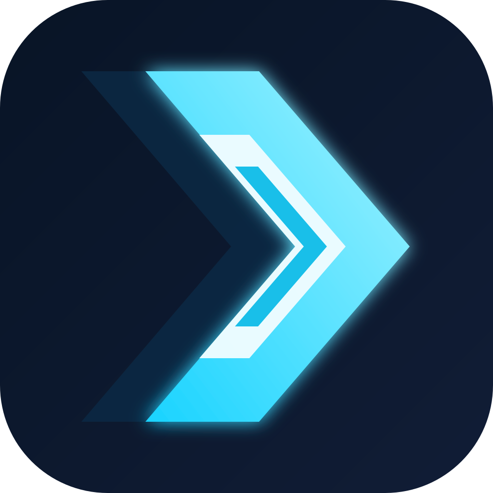

<div id="rush-logo" align="center">
   <br />
   
   <h1>Rush</h1>
   <h3>A fast, focused, automation-ready development environment</h3>
</div>

<div id="badges" align="center">

[](https://github.com/nathanalam/ide/releases/latest)
[](./LICENSE)

</div>

Rush is a rebranded build of [**VSCodium**](https://github.com/VSCodium/vscodium), the parent
project this repository is forked from. VSCodium is itself not a fork of an editor: it is a set of
scripts that build [Microsoft's `vscode` repository](https://github.com/microsoft/vscode) into
freely-licensed binaries with a community-driven default configuration — no telemetry, no tracking,
MIT licensed.

Everything upstream VSCodium does still applies here; this repository only changes the branding,
the defaults, and the release pipeline.

## Download

Every target is built by GitHub Actions and published to this repository's releases.

| Platform | Architectures | Files |
| --- | --- | --- |
| Windows | x64, arm64 | [`RushSetup-*.exe` (system), `RushUserSetup-*.exe` (user), `Rush-win32-*.zip`](https://github.com/nathanalam/ide/releases/latest) |
| macOS | x64 (Intel), arm64 (Apple silicon) | [`Rush-darwin-*.zip`](https://github.com/nathanalam/ide/releases/latest) |
| Linux | x64, arm64 | [`Rush-linux-*.tar.gz`, `rush_*.deb`, `rush-*.rpm`](https://github.com/nathanalam/ide/releases/latest) |

:tada: **[All releases](https://github.com/nathanalam/ide/releases)** &nbsp;·&nbsp;
**[Latest release](https://github.com/nathanalam/ide/releases/latest)** :tada:

The binaries are not code-signed. On macOS, remove the quarantine flag after unzipping:

```bash
xattr -dr com.apple.quarantine /Applications/Rush.app
```

In-app updates are disabled, so upgrading means downloading the newer release.

## Build

### Releases

Releases are cut from the **Release** workflow (Actions → Release → Run workflow). It resolves the
version, creates the GitHub release, and then runs the three per-platform workflows, which upload
their assets to it:

| Workflow | Runs on | Produces |
| --- | --- | --- |
| [`release.yml`](./.github/workflows/release.yml) | — | orchestrates the three below |
| [`release-windows.yml`](./.github/workflows/release-windows.yml) | `windows-2022` | `.exe` installers, `.zip` |
| [`release-macos.yml`](./.github/workflows/release-macos.yml) | `macos-15-intel`, `macos-14` | `.zip` of the `.app` bundle |
| [`release-linux.yml`](./.github/workflows/release-linux.yml) | `ubuntu` + VSCodium build containers | `.tar.gz`, `.deb`, `.rpm` |

Each platform workflow can also be run on its own, and takes an optional version. The default is
the upstream VS Code tag followed by the hours elapsed in the current year (for example
`1.135.06158`), as computed by [`release_version.sh`](./release_version.sh).

### Locally

On Linux, `deploy.sh` handles the complete Rush deployment: it prepares dependencies, builds the
bundle, creates a portable tarball, and installs it under `~/.local/opt` with a `rush` CLI command
and desktop launcher:

```bash
./deploy.sh
```

If `appimagetool` is available, an AppImage is also created in `dist/`; otherwise the portable
`.tar.gz` package is used.

For everything else — how the build scripts work, how to build by hand, and how to troubleshoot a
build — see the upstream documentation:

- [How to build](https://github.com/VSCodium/vscodium/blob/master/docs/howto-build.md)
- [Docs index](https://github.com/VSCodium/vscodium/blob/master/docs/index.md)
- [Troubleshooting](https://github.com/VSCodium/vscodium/blob/master/docs/troubleshooting.md)

## Extensions and the Marketplace

The Visual Studio Marketplace [Terms of Use](https://aka.ms/vsmarketplace-ToU) allow its extensions
to be used only with official Visual Studio products, so Rush uses
[open-vsx.org](https://open-vsx.org/) instead, like VSCodium. Some extensions are licensed for the
official builds only and will not work here — see the upstream
[extensions note](https://github.com/VSCodium/vscodium/blob/master/docs/extensions.md).

## Credits

Rush stands on [VSCodium](https://github.com/VSCodium/vscodium) and
[Microsoft's `vscode`](https://github.com/microsoft/vscode). All credit for the editor and for the
build tooling belongs to those projects and their contributors.

## License

[MIT](./LICENSE)
